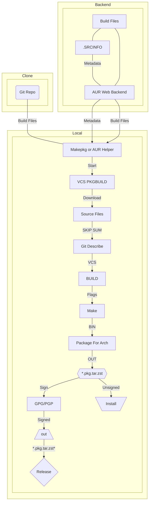

# SEQUENCE

```mermaid
flowchart TD;
A[.SRCINFO]
A1[Build Files]
B[AUR Web Backend]
B1(Git Repo)
C[Makepkg or AUR Helper]
D[VCS PKGBUILD]
E[Source Files]


G1[Git Describe]
H[BUILD]
I[Make]
J[Package For Arch]
K{{*.pkg.tar.zst}}
L[GPG/PGP]
M[\Install/]
N[/out\]
O{Release}

subgraph Clone
        subgraph  
        B1;
        end
end
B1--Build Files---C;

subgraph Backend
        subgraph  
                A--Metadata---B;
                A1---A;
                A1---B;
        end
end

subgraph Local
        subgraph  
                B--Metadata-->C;
                B--Build Files-->C;
                C--Start-->D;
                D--Download-->E;
                E--SKIP SUM-->G1;
                G1--VCS-->H;
                H--Flags-->I;
                I--BIN-->J;
                J--OUT-->K;
                K--Unsigned-->M;
                K--Sign-->L;
                L--Signed-->N
                N --*.pkg.tar.zst*--> O
        end
end
```
